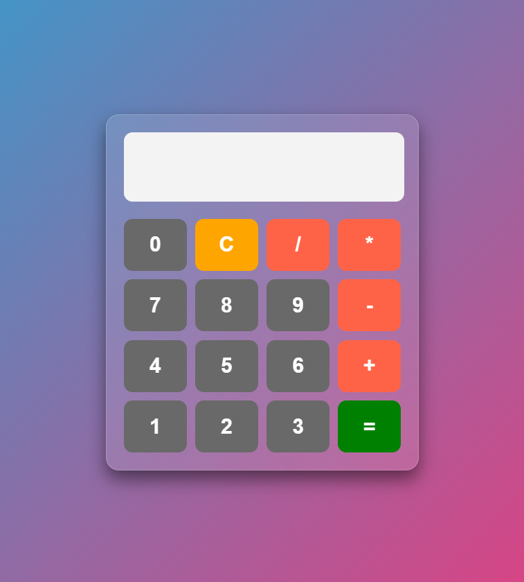

# 📱 Modern Glassmorphism Calculator

A sleek, responsive calculator built with a focus on clean UI/UX and smooth animations. This project features a modern "Glassmorphism" design and a dynamic, animated gradient background.

## 📸 Preview

## ✨ Features
- **Glassmorphism UI:** Semi-transparent calculator body with backdrop-blur effects.
- **Animated Background:** Smoothly shifting linear-gradient for a premium feel.
- **Responsive Grid:** Perfectly aligned buttons using CSS Grid.
- **Error Handling:** Built-in `try...catch` logic to handle invalid mathematical expressions.
- **Clean Code:** Hand-written JavaScript logic without external libraries.

## 🚀 Tech Stack
- **HTML5:** Semantic structure.
- **CSS3:** Advanced Grid layouts, Keyframe animations, and Backdrop filters.
- **JavaScript (ES6):** Functional logic and DOM manipulation.
